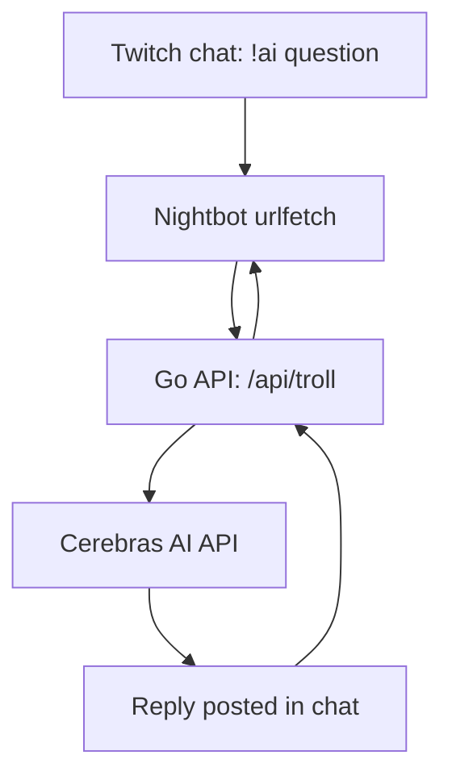

# AI API Nightbot

[Русская версия](./README.ru.md)

A small Go REST API middleware that connects [Nightbot](https://nightbot.tv) custom commands to the [Cerebras AI API](https://cerebras.ai). A viewer types a chat command, the bot forwards the question to an LLM, and the reply gets posted back into the Twitch chat.

## How it works



The service exposes one endpoint, `GET /api/troll`, which:

1. Checks the auth token and reads `user` / `text` from the query string
2. Builds a prompt from a configurable template
3. Sends it (with a system prompt) to the Cerebras API
4. Returns the AI's reply as plain text, since that's what Nightbot expects back

## Project structure

```
cmd/ai-api-nightbot/   entry point (main.go)
internal/ai/           Cerebras API client
internal/handler/      HTTP handler for /api/troll
internal/config/       env loading, prompt templates
internal/prompt/        system prompt file
```

## Requirements

- Go 1.25+
- Docker (optional, for running it in a container)
- A [Cerebras API key](https://cerebras.ai)
- A Twitch channel with Nightbot set up

## Configuration

Create a `.env` file in the project root:

```env
API_KEY=your_cerebras_api_key
SECRET_TOKEN=any_random_string
PROXY_URL=
PROMPT_TEMPLATE=troll
```

| Variable | Description |
|---|---|
| `API_KEY` | Your Cerebras API key |
| `SECRET_TOKEN` | Shared secret checked on every request, so random people can't hit your endpoint and burn through your API quota |
| `PROXY_URL` | Optional. If you're in a region where Cerebras is blocked or flaky, point this at an HTTP proxy and every AI request will be routed through it |
| `PROMPT_TEMPLATE` | Which prompt template to use, see `internal/config` for the available keys |

You need something random for `SECRET_TOKEN`. A couple of ways to get it:

```bash
openssl rand -hex 8
```

or in Node:

```bash
node -e "console.log(require('crypto').randomBytes(8).toString('hex'))"
```

Any method that gives you a random string works fine, it just has to be hard to guess.

The system prompt (the bot's personality) lives in `internal/prompt/prompt.txt`. Edit it to change how the bot talks.

## Running locally

```bash
go run ./cmd/ai-api-nightbot
```

The server listens on port `7777`.

## Running with Docker

```bash
docker build -t ai-api-nightbot .
docker run -d --name ai-api-nightbot -p 7777:7777 --env-file .env ai-api-nightbot
```

## API

### `GET /api/troll`

| Query param | Required | Description |
|---|---|---|
| `user` | no | Viewer's username, falls back to "Зритель" if missing |
| `text` | yes | The question to send to the AI |
| `token` | yes | Must match `SECRET_TOKEN` |

Returns plain text, 400 characters or less, per Nightbot's limit.

## Setting up the Nightbot command

You can add the command either through chat or from your [Nightbot dashboard](https://nightbot.tv/commands/custom).

Through chat:

```
!commands add !ai $(urlfetch http://your-server-ip:7777/api/troll?user=$(user)&text=$(querystring)&token=YOUR_SECRET_TOKEN)
```

Or in the dashboard, just create a new custom command with the same response text. Swap in your real server IP and token. After that, viewers can type `!ai <anything>` and get a reply.

## License

MIT