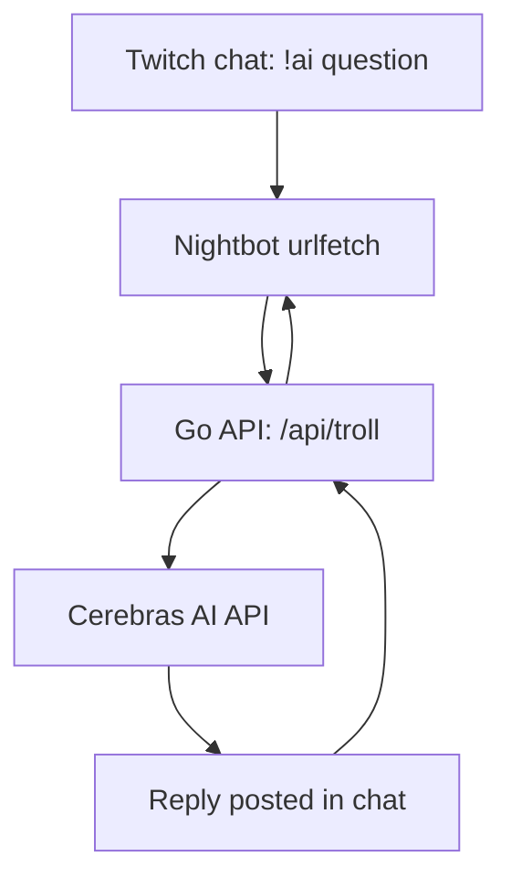

# AI API Nightbot

[English version](./README.md)

Небольшой REST API на Go, который связывает кастомные команды [Nightbot](https://nightbot.tv) с [Cerebras AI API](https://cerebras.ai). Зритель пишет команду в чате, бот пересылает вопрос нейронке, и ответ постится обратно в чат Twitch.

## Как это работает



Сервис отдаёт один эндпоинт, `GET /api/troll`, который:

1. Проверяет токен и читает `user` / `text` из query-параметров
2. Собирает промпт по настраиваемому шаблону
3. Отправляет его (вместе с системным промптом) в Cerebras API
4. Возвращает ответ AI как обычный текст, потому что именно его ждёт Nightbot

## Структура проекта

```
cmd/ai-api-nightbot/   точка входа (main.go)
internal/ai/           клиент для Cerebras API
internal/handler/      HTTP-хендлер для /api/troll
internal/config/       загрузка env, шаблоны промптов
internal/prompt/        файл системного промпта
```

## Что нужно

- Go 1.25+
- Docker (опционально, если хочешь гонять в контейнере)
- [API-ключ Cerebras](https://cerebras.ai)
- Twitch-канал с подключённым Nightbot

## Конфигурация

Создай `.env` файл в корне проекта:

```env
API_KEY=ваш_cerebras_api_key
SECRET_TOKEN=любая_случайная_строка
PROXY_URL=
PROMPT_TEMPLATE=troll
```

| Переменная | Описание |
|---|---|
| `API_KEY` | Твой API-ключ Cerebras |
| `SECRET_TOKEN` | Секрет, который проверяется на каждом запросе, чтобы рандомные люди не дёргали твой эндпоинт и не жгли квоту API |
| `PROXY_URL` | Опционально. Если ты в регионе, где Cerebras блокируется или работает нестабильно, укажи здесь адрес HTTP-прокси, и все запросы к AI пойдут через него |
| `PROMPT_TEMPLATE` | Какой шаблон промпта использовать, доступные ключи смотри в `internal/config` |

Для `SECRET_TOKEN` нужна просто случайная строка. Пара способов получить:

```bash
openssl rand -hex 8
```

или через Node:

```bash
node -e "console.log(require('crypto').randomBytes(8).toString('hex'))"
```

Способ не важен, главное чтобы строка была случайной и её было сложно угадать.

Системный промпт (характер бота) лежит в `internal/prompt/prompt.txt`. Меняй его, чтобы поменять, как бот разговаривает.

## Запуск локально

```bash
go run ./cmd/ai-api-nightbot
```

Сервер слушает порт `7777`.

## Запуск через Docker

```bash
docker build -t ai-api-nightbot .
docker run -d --name ai-api-nightbot -p 7777:7777 --env-file .env ai-api-nightbot
```

## API

### `GET /api/troll`

| Query-параметр | Обязателен | Описание |
|---|---|---|
| `user` | нет | Имя зрителя, по умолчанию "Зритель", если не передано |
| `text` | да | Вопрос для AI |
| `token` | да | Должен совпадать с `SECRET_TOKEN` |

Возвращает обычный текст, не больше 400 символов, по лимиту Nightbot.

## Настройка команды в Nightbot

Добавить команду можно через чат или в [личном кабинете Nightbot](https://nightbot.tv/commands/custom).

Через чат:

```
!commands add !ai $(urlfetch http://адрес-твоего-сервера:7777/api/troll?user=$(user)&text=$(querystring)&token=ТВОЙ_СЕКРЕТНЫЙ_ТОКЕН)
```

Или в личном кабинете просто создай новую кастомную команду с тем же текстом ответа. Подставь свой реальный IP сервера и токен. После этого зрители могут писать `!ai <что угодно>` и получать ответ.

## Лицензия

MIT